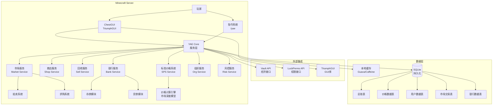
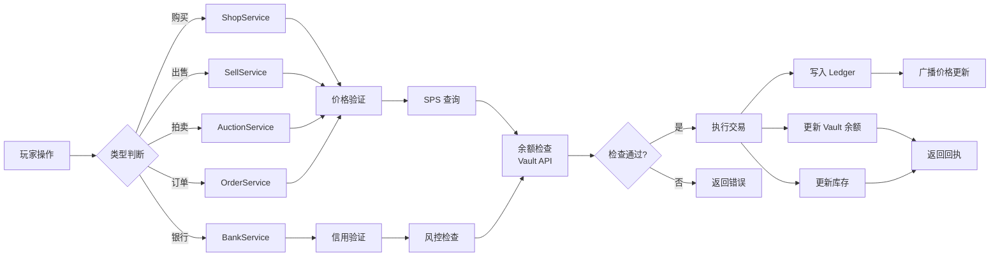
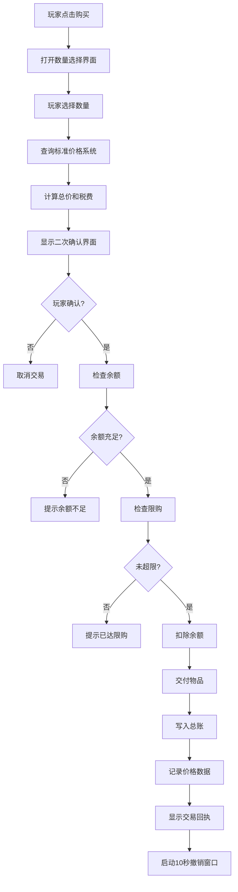
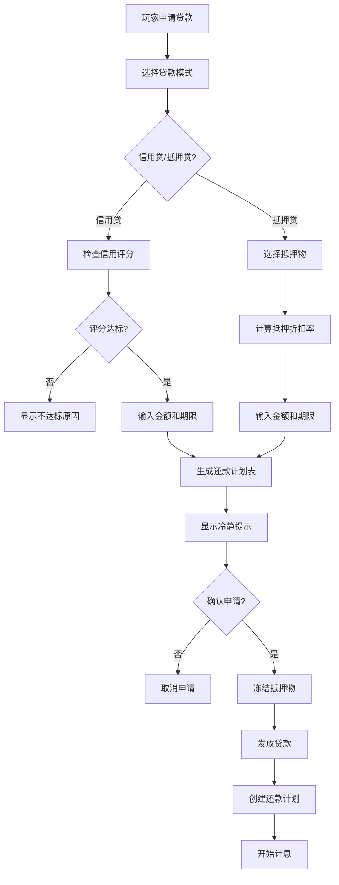
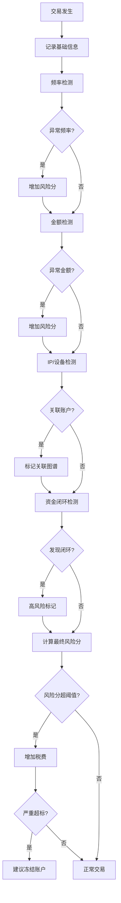

# YAE 设计文档

## 概述

本文档描述 Yet Another Economy (YAE) 的架构设计。YAE 是一个基于 Minecraft Paper/Spigot 的高性能经济系统插件，支持200+在线玩家，采用 Vault 经济集成、SQLite 持久化、完整 NBT 物品识别。

## 架构设计

### 系统架构图



### 数据流图



## 组件设计

### 1. YAE Core (核心服务层)

**职责：**
- 插件生命周期管理
- 服务注册与发现
- 配置管理
- 事件总线

**接口：**
```java
public interface YAECore {
    void registerService(ServiceType type, Service service);
    Service getService(ServiceType type);
    Configuration getConfig();
    void fireEvent(YAEEvent event);
}
```

### 2. StandardPriceSystem (标准价格系统)

**职责：**
- 价格计算（市场深度模型）
- 价格缓存与广播
- 历史数据管理

**接口：**
```java
public interface StandardPriceSystem {
    PriceData getPrice(ItemStack item);
    void recordTransaction(ItemStack item, double price, int amount);
    void updatePrices();
    void broadcastPriceUpdate(ItemStack item, PriceData data);
}
```

**价格计算算法（市场深度模型）：**
```java
public class MarketDepthPriceCalculator {
    public double calculateStandardPrice(List<Transaction> recentTransactions) {
        // 1. 获取近期交易（如最近7天）
        // 2. 按价格分组统计成交量
        // 3. 找到成交量最大的价格区间
        // 4. 考虑买卖盘深度进行微调
        // 5. 应用平滑系数避免剧烈波动
    }
}
```

### 3. ShopService (商店服务)

**职责：**
- 系统商店物品管理
- 购买流程处理
- 限购检查

**接口：**
```java
public interface ShopService {
    List<ShopItem> getAvailableItems(Player player);
    PurchaseResult purchase(Player player, ShopItem item, int amount);
    boolean checkDailyLimit(Player player, ShopItem item, int amount);
}
```

### 4. SellService (回收服务)

**职责：**
- 可回收物品识别（基于NBT）
- 回收价格计算
- 高风险物品检测

**接口：**
```java
public interface SellService {
    List<SellableItem> getSellableItems(Player player);
    double calculateSellPrice(ItemStack item);
    SellResult sell(Player player, ItemStack item, int amount);
    boolean isHighRiskItem(ItemStack item);
}
```

### 5. MarketService (市场服务)

**职责：**
- 拍卖系统管理
- 求购订单管理
- 交易撮合

**子组件：**

**AuctionService：**
```java
public interface AuctionService {
    Auction createAuction(Player player, ItemStack item, double price, Duration duration);
    AuctionResult bid(Player player, Auction auction);
    void cancelAuction(Player player, Auction auction);
    List<Auction> getActiveAuctions(Filter filter);
}
```

**OrderService：**
```java
public interface OrderService {
    Order createOrder(Player player, ItemStack item, double price, int amount, Duration duration);
    DeliveryResult deliver(Player player, Order order, int amount);
    void cancelOrder(Player player, Order order);
    List<Order> getAvailableOrders(Player player);
}
```

**订单匹配机制（FIFO + 反狙击）：**
```java
public class OrderMatcher {
    public Player selectWinner(List<Player> candidates, Order order) {
        // 1. 按请求时间排序（FIFO）
        // 2. 检查是否有恶意抢单行为（短时间内频繁抢单）
        // 3. 信用评分高的玩家优先
        // 4. 返回最终胜者
    }
}
```

### 6. BankService (银行服务)

**职责：**
- 存款管理（活期/定期）
- 贷款管理（抵押/信用）
- 自动扣款与逾期处理

**子组件：**

**DepositService：**
```java
public interface DepositService {
    DepositResult depositCurrent(Player player, double amount);
    DepositResult depositFixed(Player player, double amount, Duration term);
    WithdrawResult withdraw(Player player, double amount);
    WithdrawResult earlyWithdrawFixed(Player player, FixedDeposit deposit);
    double calculateInterest(Player player);
}
```

**LoanService：**
```java
public interface LoanService {
    Loan applyCollateralLoan(Player player, double amount, Duration term, Collateral collateral);
    Loan applyCreditLoan(Player player, double amount, Duration term);
    RepaymentResult repay(Player player, Loan loan, double amount);
    void processAutoDeduction();
    void processOverdue();
}
```

### 7. OrganizationService (组织服务)

**职责：**
- 组织账户管理
- 权限集成（LuckPerms）
- 成员管理

**接口：**
```java
public interface OrganizationService {
    Organization createOrganization(Player creator, String name);
    boolean checkPermission(Player player, Organization org, Permission permission);
    void addMember(Organization org, Player player, Role role);
    Account getOrganizationAccount(Organization org);
}
```

### 8. RiskControlService (风控服务)

**职责：**
- 异常交易检测
- 关联账户分析
- 风险评分计算

**接口：**
```java
public interface RiskControlService {
    RiskScore assessTransaction(Player player, Transaction transaction);
    void recordIPDevice(Player player, String ip, String deviceId);
    List<Player> findRelatedAccounts(Player player);
    void freezeAccount(Player player, String reason);
    void rollbackTransactions(Player player, Duration period);
}
```

**检测规则：**
```java
public class RiskRules {
    // 交易频率检测
    boolean checkTransactionFrequency(Player player, Duration window, int threshold);
    
    // 交易金额检测
    boolean checkTransactionAmount(Player player, double amount);
    
    // 资金闭环检测
    boolean detectMoneyLoop(Player player, List<Transaction> history);
    
    // 关联账户检测
    boolean checkRelatedAccounts(List<Player> accounts);
}
```

### 9. LedgerService (总账服务)

**职责：**
- 交易记录写入
- 账本查询与导出
- 数据归档

**接口：**
```java
public interface LedgerService {
    void record(Transaction transaction);
    List<Transaction> query(LedgerQuery query);
    void export(File file, Format format);
    void archive(Duration retention);
}
```

## 数据模型

### 核心数据结构

```java
// 价格数据
public class PriceData {
    private ItemStack item;           // 物品（含完整NBT）
    private double standardPrice;     // 标准价格
    private double minPrice;          // 价格下限
    private double maxPrice;          // 价格上限
    private Liquidity liquidity;      // 流动性等级（低/中/高）
    private long lastUpdate;          // 最后更新时间
}

// 交易记录
public class Transaction {
    private String id;                // 交易编号
    private TransactionType type;     // 交易类型
    private UUID playerId;            // 玩家UUID
    private UUID counterpartyId;      // 对手方UUID（可为空）
    private ItemStack item;           // 物品
    private int amount;               // 数量
    private double price;             // 单价
    private double total;             // 总价
    private double tax;               // 税费
    private double fee;               // 手续费
    private long timestamp;           // 时间戳
    private TransactionStatus status; // 状态
    private String failureReason;     // 失败原因（如失败）
}

// 银行账户
public class BankAccount {
    private UUID ownerId;             // 所有者UUID
    private AccountType type;         // 账户类型（个人/组织）
    private double currentBalance;    // 活期余额
    private List<FixedDeposit> fixedDeposits; // 定期存款列表
    private CreditScore creditScore;  // 信用评分
}

// 定期存款
public class FixedDeposit {
    private String id;                // 存款ID
    private double principal;         // 本金
    private double interestRate;      // 利率
    private long startTime;           // 开始时间
    private long maturityTime;        // 到期时间
    private boolean autoRenew;        // 是否自动续期
}

// 贷款
public class Loan {
    private String id;                // 贷款ID
    private UUID borrowerId;          // 借款人
    private LoanType type;            // 贷款类型（抵押/信用）
    private double principal;         // 本金
    private double interestRate;      // 利率
    private double remaining;         // 剩余应还
    private List<Repayment> schedule; // 还款计划
    private Collateral collateral;    // 抵押物（抵押贷）
    private LoanStatus status;        // 状态
    private long nextDueDate;         // 下次还款日
}

// 组织账户
public class Organization {
    private String id;                // 组织ID
    private String name;              // 组织名称
    private UUID creatorId;           // 创建者
    private List<Member> members;     // 成员列表
    private BankAccount account;      // 组织账户
}

// 风险评分
public class RiskScore {
    private UUID playerId;            // 玩家UUID
    private int score;                // 风险分数（0-100）
    private List<String> factors;     // 风险因素
    private long lastUpdate;          // 最后更新
}
```

### 数据库表结构

```sql
-- 价格表
CREATE TABLE prices (
    item_hash TEXT PRIMARY KEY,     -- 物品NBT哈希
    item_nbt BLOB,                  -- 完整NBT数据
    standard_price REAL,
    min_price REAL,
    max_price REAL,
    liquidity TEXT,
    update_count INTEGER,
    last_update TIMESTAMP
);

-- 交易历史表（用于价格计算）
CREATE TABLE price_history (
    id INTEGER PRIMARY KEY AUTOINCREMENT,
    item_hash TEXT,
    price REAL,
    amount INTEGER,
    timestamp TIMESTAMP,
    FOREIGN KEY (item_hash) REFERENCES prices(item_hash)
);

-- 总账表
CREATE TABLE ledger (
    id TEXT PRIMARY KEY,
    type TEXT,
    player_uuid TEXT,
    counterparty_uuid TEXT,
    item_hash TEXT,
    amount INTEGER,
    price REAL,
    total REAL,
    tax REAL,
    fee REAL,
    timestamp TIMESTAMP,
    status TEXT,
    failure_reason TEXT
);

-- 用户账户表
CREATE TABLE accounts (
    uuid TEXT PRIMARY KEY,
    type TEXT,
    current_balance REAL,
    credit_score INTEGER,
    daily_buy_limit_used INTEGER,
    daily_sell_limit_used INTEGER,
    last_limit_reset TIMESTAMP
);

-- 定期存款表
CREATE TABLE fixed_deposits (
    id TEXT PRIMARY KEY,
    account_uuid TEXT,
    principal REAL,
    interest_rate REAL,
    start_time TIMESTAMP,
    maturity_time TIMESTAMP,
    auto_renew BOOLEAN,
    FOREIGN KEY (account_uuid) REFERENCES accounts(uuid)
);

-- 贷款表
CREATE TABLE loans (
    id TEXT PRIMARY KEY,
    borrower_uuid TEXT,
    type TEXT,
    principal REAL,
    interest_rate REAL,
    remaining REAL,
    status TEXT,
    next_due_date TIMESTAMP,
    FOREIGN KEY (borrower_uuid) REFERENCES accounts(uuid)
);

-- 组织表
CREATE TABLE organizations (
    id TEXT PRIMARY KEY,
    name TEXT,
    creator_uuid TEXT,
    created_at TIMESTAMP
);

-- 组织成员表
CREATE TABLE org_members (
    org_id TEXT,
    player_uuid TEXT,
    role TEXT,
    joined_at TIMESTAMP,
    PRIMARY KEY (org_id, player_uuid)
);

-- 风控记录表
CREATE TABLE risk_records (
    id INTEGER PRIMARY KEY AUTOINCREMENT,
    player_uuid TEXT,
    score INTEGER,
    factors TEXT,  -- JSON数组
    timestamp TIMESTAMP
);

-- IP/设备关联表
CREATE TABLE device_links (
    player_uuid TEXT,
    ip_address TEXT,
    device_id TEXT,
    last_seen TIMESTAMP,
    PRIMARY KEY (player_uuid, ip_address, device_id)
);
```

## 业务流程

### 1. 购买流程



### 2. 贷款申请流程



### 3. 风控检测流程



## 错误处理策略

### 交易失败处理

```java
public class TransactionErrorHandler {
    public void handleError(Transaction transaction, Exception e) {
        // 1. 记录失败原因到总账
        transaction.setStatus(TransactionStatus.FAILED);
        transaction.setFailureReason(e.getMessage());
        ledgerService.record(transaction);
        
        // 2. 回滚已执行的操作
        if (balanceDeducted) vaultService.deposit(transaction.getPlayerId(), transaction.getTotal());
        if (itemDelivered) inventoryService.removeItem(transaction.getPlayerId(), transaction.getItem());
        
        // 3. 通知玩家
        messageService.sendErrorMessage(transaction.getPlayerId(), "交易失败: " + e.getMessage());
    }
}
```

### 数据库错误处理

```java
public class DatabaseErrorHandler {
    public void handleConnectionFailure() {
        // 1. 记录错误日志
        logger.error("数据库连接失败，启动重试机制");
        
        // 2. 重试连接（指数退避）
        retryWithBackoff();
        
        // 3. 如果持续失败，进入只读模式
        if (retryCount > MAX_RETRY) {
            enterReadOnlyMode();
            notifyAdmin();
        }
    }
}
```

## 性能优化策略

### 缓存策略

```java
public class CacheManager {
    // 价格缓存 - 短期高频访问
    private LoadingCache<ItemStack, PriceData> priceCache = Caffeine.newBuilder()
        .maximumSize(10000)
        .expireAfterWrite(5, TimeUnit.MINUTES)
        .build(this::loadPriceFromDB);
    
    // 玩家余额缓存 - 避免频繁查询Vault
    private Cache<UUID, Double> balanceCache = Caffeine.newBuilder()
        .maximumSize(5000)
        .expireAfterWrite(30, TimeUnit.SECONDS)
        .build();
    
    // 物品NBT哈希缓存 - 加速物品识别
    private Cache<ItemStack, String> nbtHashCache = Caffeine.newBuilder()
        .maximumSize(50000)
        .expireAfterAccess(1, TimeUnit.HOURS)
        .build();
}
```

### 批量操作

```java
public class BatchProcessor {
    // 批量写入总账 - 减少数据库IO
    private List<Transaction> pendingTransactions = new ArrayList<>();
    
    @Scheduled(fixedRate = 5000)
    public void flushTransactions() {
        if (pendingTransactions.isEmpty()) return;
        
        database.batchInsert(pendingTransactions);
        pendingTransactions.clear();
    }
}
```

## 测试策略

### 单元测试重点

1. **价格计算引擎测试** - 验证市场深度模型的正确性
2. **交易逻辑测试** - 验证各种交易场景下的数据一致性
3. **风控规则测试** - 验证异常检测规则的准确性
4. **利息计算测试** - 验证存款/贷款的利息计算准确性

### 集成测试重点

1. **Vault 集成测试** - 验证余额读写的正确性
2. **数据库事务测试** - 验证事务回滚机制
3. **GUI 交互测试** - 验证 ChestGUI 的用户流程
4. **并发测试** - 验证多玩家同时操作的正确处理
