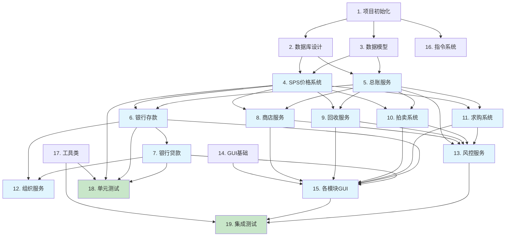

# YAE 实现计划

## 说明

本计划将 YAE 功能转换为可执行的编码任务，采用测试驱动开发模式，确保增量式、无断点的实现。每个任务都引用对应的需求文档条目。

---

## 阶段一：项目基础架构

### 任务 1：项目初始化与依赖配置

- [ ] **1.1 创建 Maven/Gradle 项目结构**
  - 创建标准 Paper 插件项目结构
  - 配置 plugin.yml，包含插件名称、版本、依赖（Vault、LuckPerms、TriumphGUI）
  - 配置数据库连接（SQLite）
  - _需求: 非功能需求-兼容性需求_

- [ ] **1.2 创建核心服务接口与注册机制**
  - 创建 ServiceType 枚举定义所有服务类型
  - 创建 YAECore 接口和实现类
  - 实现服务注册与获取机制
  - 创建 YAEEvent 事件基类
  - _需求: 需求 1.1, 2.1_

- [ ] **1.3 实现配置管理系统**
  - 创建 ConfigManager 加载和保存配置文件
  - 实现 lang.yml 文本配置（所有GUI文本可配置）
  - 实现 config.yml 系统参数配置
  - 支持配置热重载
  - _需求: 需求 12.1, 12.2, 12.3_

---

## 阶段二：数据层与持久化

### 任务 2：数据库设计与连接

- [ ] **2.1 创建数据库连接管理器**
  - 实现 DatabaseManager 管理 SQLite 连接
  - 实现连接池（或复用 HikariCP）
  - 实现数据库健康检查和重连机制
  - _需求: 非功能需求-可靠性需求_

- [ ] **2.2 创建数据库迁移系统**
  - 实现 Flyway/Liquibase 风格的迁移脚本
  - 创建所有表结构（prices, ledger, accounts, fixed_deposits, loans, organizations, org_members, risk_records, device_links）
  - 创建必要的索引优化查询性能
  - _需求: 设计文档-数据库表结构_

- [ ] **2.3 实现事务管理器**
  - 创建 TransactionManager 管理数据库事务
  - 实现事务回滚机制
  - 确保交易操作的原子性
  - _需求: 非功能需求-安全需求_

---

### 任务 3：数据模型与缓存

- [ ] **3.1 实现核心数据模型**
  - 创建 PriceData、Transaction、BankAccount、FixedDeposit、Loan、Organization、RiskScore 等实体类
  - 实现 ItemStack 的 NBT 序列化/反序列化（完整NBT支持）
  - 实现实体类的验证逻辑
  - _需求: 需求 1.1, 11.1, 设计文档-数据模型_

- [ ] **3.2 实现缓存管理系统**
  - 集成 Caffeine 缓存库
  - 实现 PriceCache（价格数据缓存，5分钟过期）
  - 实现 BalanceCache（余额缓存，30秒过期）
  - 实现 NbtHashCache（NBT哈希缓存，1小时访问过期）
  - _需求: 设计文档-缓存策略_

- [ ] **3.3 实现 DAO 层（数据访问对象）**
  - 创建 PriceDao、LedgerDao、AccountDao、LoanDao、OrgDao、RiskDao
  - 实现基础 CRUD 操作
  - 实现批量插入优化
  - _需求: 设计文档-数据模型_

---

## 阶段三：核心服务实现

### 任务 4：标准价格系统 (SPS)

- [ ] **4.1 实现 NBT 物品识别系统**
  - 创建 ItemIdentifier 工具类计算物品NBT哈希
  - 实现完整NBT比较（包括附魔、Lore、自定义NBT等）
  - 创建物品黑名单检测（命令方块、屏障、特定NBT标签）
  - _需求: 需求 3.4, 11.4_

- [ ] **4.2 实现价格计算引擎（市场深度模型）**
  - 创建 MarketDepthCalculator 类
  - 实现基于成交量分布的价格计算算法
  - 实现平滑系数避免价格剧烈波动
  - 实现流动性等级评估
  - _需求: 需求 1.3, 1.7_

- [ ] **4.3 实现 SPS 核心服务**
  - 创建 StandardPriceSystemImpl 实现 SPS 接口
  - 实现价格查询（带缓存）
  - 实现交易记录和价格更新
  - 实现价格广播机制
  - _需求: 需求 1.1, 1.2, 1.4, 1.5_

---

### 任务 5：账本服务

- [ ] **5.1 实现总账记录系统**
  - 创建 LedgerServiceImpl
  - 实现 Transaction 记录写入
  - 实现失败交易记录（含失败原因）
  - 实现交易回执生成（含交易编号）
  - _需求: 需求 10.1, 10.2, 10.3_

- [ ] **5.2 实现账本查询与导出**
  - 实现个人流水查询（时间倒序）
  - 实现管理员总账查询（按玩家/物品/时间筛选）
  - 实现 CSV/JSON 导出功能
  - _需求: 需求 10.5, 10.6, 10.7_

- [ ] **5.3 实现数据归档系统**
  - 创建归档任务（每天执行）
  - 实现详细日志90天自动归档
  - 实现摘要数据永久保留
  - _需求: 需求 10.4, 10.8_

---

### 任务 6：银行服务 - 存款

- [ ] **6.1 实现银行账户管理**
  - 创建 BankAccountManager
  - 实现账户创建和查询
  - 实现活期/定期账户分离管理
  - 集成 Vault 余额读写
  - _需求: 需求 6.1, 6.2_

- [ ] **6.2 实现存款逻辑**
  - 实现活期存款（+1/+10/+100/+1000/Max/输入）
  - 实现定期存款（7/14/30/60/90天期限）
  - 实现利率计算和到期收益预览
  - _需求: 需求 6.3, 6.4, 6.5_

- [ ] **6.3 实现取款与利息计算**
  - 实现活期取款
  - 实现定期到期自动转存
  - 实现提前支取罚息计算（可配置规则）
  - 实现利息自动计算和发放
  - _需求: 需求 6.6, 6.7, 6.8, 12.6_

---

### 任务 7：银行服务 - 贷款

- [ ] **7.1 实现信用评分系统**
  - 创建 CreditScoreCalculator
  - 基于历史交易、还款记录计算信用分
  - 实现信用分查询接口
  - _需求: 需求 7.2_

- [ ] **7.2 实现贷款申请流程**
  - 实现抵押贷款申请（选择抵押物、计算折扣率）
  - 实现信用贷款申请（信用分检查）
  - 生成还款计划表（等额本息/到期还本付息）
  - _需求: 需求 7.1, 7.2, 7.3, 7.4_

- [ ] **7.3 实现贷款还款与逾期处理**
  - 实现自动扣款（还款日自动扣减）
  - 实现手动还款和提前还款
  - 实现逾期处理流程（罚息→限制交易→扣押抵押→黑名单）
  - _需求: 需求 7.5, 7.6, 7.7, 7.8, 7.9, 7.10_

---

### 任务 8：商店服务

- [ ] **8.1 实现商店物品管理**
  - 创建 ShopManager
  - 实现可购买物品配置加载
  - 实现物品分类管理
  - _需求: 需求 2.1_

- [ ] **8.2 实现购买流程**
  - 实现物品详情展示（商店价、标准价、价格区间）
  - 实现数量选择和总价计算
  - 实现税费计算和显示
  - 实现余额检查和限购检查
  - _需求: 需求 2.2, 2.3, 2.4, 2.7_

- [ ] **8.3 实现购买确认与回执**
  - 实现二次确认界面
  - 实现10秒撤销窗口
  - 生成交易回执
  - _需求: 需求 2.5, 2.6, 2.8_

---

### 任务 9：回收服务

- [ ] **9.1 实现可回收物品识别**
  - 创建 SellServiceImpl
  - 实现背包物品扫描（基于NBT过滤）
  - 实现高风险物品检测
  - _需求: 需求 3.1, 3.3_

- [ ] **9.2 实现回收价格计算**
  - 实现回收价 = 标准价 × r_buyback 系数
  - 实现高风险物品使用更低回收系数
  - 实现每日回收限额检查
  - _需求: 需求 3.2, 3.5_

- [ ] **9.3 实现出售流程**
  - 实现数量选择和收入计算
  - 实现"回收后不可撤回"提示
  - 实现交易回执生成
  - _需求: 需求 3.4, 3.6, 3.7, 3.8_

---

### 任务 10：市场服务 - 拍卖

- [ ] **10.1 实现拍卖上架**
  - 创建 AuctionManager
  - 实现物品上架（选择物品、设置价格、设置时长）
  - 实现上架费用计算和扣除
  - 实现物品冻结（防止重复上架）
  - _需求: 需求 4.1, 4.4, 4.5_

- [ ] **10.2 实现拍卖浏览与购买**
  - 实现拍卖列表（支持分类、价格、时间筛选）
  - 实现拍卖详情查看
  - 实现购买流程（扣款、交付物品、资金转移）
  - _需求: 需求 4.6, 4.7_

- [ ] **10.3 实现拍卖下架与超时**
  - 实现玩家主动下架（显示损失的上架费）
  - 实现超时自动下架并退回物品
  - 实现偏离价格警告（偏离标准价阈值时额外确认）
  - _需求: 需求 4.3, 4.8, 4.9_

---

### 任务 11：市场服务 - 求购订单

- [ ] **11.1 实现订单发布**
  - 创建 OrderManager
  - 实现订单发布（选择物品、数量、单价、有效期）
  - 实现资金冻结
  - 实现价格偏离警告
  - _需求: 需求 5.1, 5.2, 5.3_

- [ ] **11.2 实现订单浏览与接单**
  - 实现订单列表（基于背包物品智能匹配）
  - 实现可交付数量计算（受背包限制）
  - _需求: 需求 5.4, 5.5_

- [ ] **11.3 实现订单交付与匹配**
  - 实现 FIFO + 反狙击 匹配机制
  - 实现交付流程（扣除物品、增加余额、交付给求购者）
  - 实现订单取消和资金解冻
  - _需求: 需求 5.6, 5.7, 5.8_

---

### 任务 12：组织服务

- [ ] **12.1 实现组织账户管理**
  - 创建 OrganizationManager
  - 实现组织创建和基础信息管理
  - 实现成员角色管理（与 LuckPerms 集成）
  - _需求: 需求 8.1, 8.2_

- [ ] **12.2 实现组织权限与账户**
  - 实现权限检查（存款、取款、贷款等细粒度权限）
  - 实现组织银行账户管理
  - 实现组织交易记录（记录操作人）
  - _需求: 需求 8.3, 8.4, 8.5_

- [ ] **12.3 实现组织风控**
  - 实现组织账户逾期处理（限制所有成员）
  - 实现组织账户冻结通知
  - _需求: 需求 8.6, 8.7_

---

### 任务 13：风控服务

- [ ] **13.1 实现交易检测**
  - 创建 RiskControlServiceImpl
  - 实现交易频率检测
  - 实现交易金额检测
  - 实现异常交易标记
  - _需求: 需求 9.1, 9.2_

- [ ] **13.2 实现关联账户分析**
  - 实现 IP/设备记录和关联检测
  - 实现关联账户图谱构建
  - 实现资金闭环检测
  - _需求: 需求 9.3, 9.4_

- [ ] **13.3 实现风险评分与处置**
  - 实现风险评分计算
  - 实现自动增加税费（风险分超阈值）
  - 实现账户冻结建议
  - 实现交易回滚功能
  - _需求: 需求 9.5, 9.6, 9.7, 9.8, 9.9_

---

## 阶段四：GUI 界面

### 任务 14：GUI 基础框架

- [ ] **14.1 集成 TriumphGUI**
  - 添加 TriumphGUI 依赖
  - 创建 GUIManager 管理所有界面
  - 实现统一的面包屑导航
  - 实现右下角固定按钮（返回、主菜单、关闭）
  - _需求: 需求 11.2, 11.3_

- [ ] **14.2 实现通用交互组件**
  - 实现 ItemPicker（物品选择器，含搜索、收藏）
  - 实现 QtyStepper（数量选择器：-64/-10/-1/+1/+10/+64/Max/输入）
  - 实现 PriceSetter（价格输入器，显示参考价和建议区间）
  - 实现 ConfirmScreen（二次确认界面）
  - 实现 ReceiptScreen（交易回执）
  - _需求: 需求 11.5, 11.6_

---

### 任务 15：主菜单与各模块界面

- [ ] **15.1 实现主菜单界面**
  - 创建 54 格主菜单（6行）
  - 实现玩家信息条（余额、信用评分、今日税优惠/惩罚）
  - 实现 9 个模块入口按钮
  - _需求: 需求 11.1, 2.1_

- [ ] **15.2 实现 Shop GUI**
  - 实现分类浏览界面
  - 实现物品详情页
  - 实现购买确认界面
  - _需求: 需求 2.1, 2.2, 2.5_

- [ ] **15.3 实现 Sell GUI**
  - 实现背包物品扫描展示
  - 实现可回收列表界面
  - 实现出售确认界面
  - _需求: 需求 3.1, 3.6_

- [ ] **15.4 实现 Market GUI**
  - 实现市场统一入口（拍卖/求购切换）
  - 实现拍卖浏览/上架界面
  - 实现求购订单浏览/发布界面
  - _需求: 需求 4.1, 4.6, 5.1, 5.4_

- [ ] **15.5 实现 Bank GUI**
  - 实现银行首页（余额、利率、信用分、负债）
  - 实现存款/取款界面
  - 实现定期存款界面
  - 实现贷款申请界面（含还款计划展示）
  - 实现我的贷款管理界面
  - _需求: 需求 6.1, 6.4, 7.1, 7.9_

---

## 阶段五：指令与工具

### 任务 16：指令系统

- [ ] **16.1 实现基础指令**
  - 实现 /yae 打开主菜单
  - 实现 /yae help 显示帮助
  - _需求: 需求 11.1_

- [ ] **16.2 实现管理员指令**
  - 实现 /yae admin freeze <玩家> [原因]
  - 实现 /yae admin rollback <玩家> <时间段>
  - 实现 /yae admin audit <玩家>
  - 实现 /yae admin config reload
  - _需求: 需求 9.8, 9.9_

- [ ] **16.3 实现调试指令**
  - 实现 /yae debug ledger <玩家>
  - 实现 /yae debug price <物品>
  - 实现 /yae debug risk <玩家>
  - _需求: 需求 10.6, 9.7_

---

### 任务 17：工具与工具类

- [ ] **17.1 实现工具类库**
  - 创建 ItemUtils（物品操作工具）
  - 创建 TimeUtils（时间格式化工具）
  - 创建 MathUtils（数学计算工具，利息、税费等）
  - 创建 MessageUtils（消息格式化工具）

- [ ] **17.2 实现反刷钱保护**
  - 实现 Shop售价 > SPS价 > Sell回收价 的价格校验
  - 实现个人每日交易限额检查
  - 实现买入后冷却期检查
  - _需求: 需求 3.5, 防刷机制_

---

## 阶段六：测试与优化

### 任务 18：单元测试

- [ ] **18.1 测试价格计算引擎**
  - 测试市场深度模型的各种场景
  - 测试边界条件（无历史数据、极端波动）
  - _需求: 需求 1.3, 1.7_

- [ ] **18.2 测试银行逻辑**
  - 测试利息计算（活期/定期）
  - 测试罚息计算（各种配置规则）
  - 测试还款计划生成
  - _需求: 需求 6.5, 6.7, 7.3_

- [ ] **18.3 测试交易逻辑**
  - 测试各种交易类型的数据一致性
  - 测试事务回滚机制
  - _需求: 非功能需求-安全需求_

---

### 任务 19：集成测试

- [ ] **19.1 测试 Vault 集成**
  - 测试余额读写的正确性
  - 测试并发场景下的数据一致性
  - _需求: 非功能需求-兼容性需求_

- [ ] **19.2 测试并发性能**
  - 模拟200+玩家同时操作
  - 测试响应时间和系统稳定性
  - _需求: 非功能需求-性能需求_

- [ ] **19.3 测试 GUI 交互**
  - 测试所有用户流程
  - 测试异常输入处理
  - _需求: 需求 11.x_

---

## 任务依赖图

**图例说明：**
- 蓝色填充 (#e1f5fe)：核心服务模块，可并行开发
- 绿色填充 (#c8e6c9)：测试任务

---

## 文档输出

完成以上任务后，将生成以下交付物：

1. **源代码**：完整的 YAE 插件代码
2. **配置文件**：config.yml、lang.yml 模板
3. **数据库迁移脚本**：所有表结构和初始数据
4. **测试报告**：单元测试和集成测试结果
5. **部署文档**：安装和配置指南
